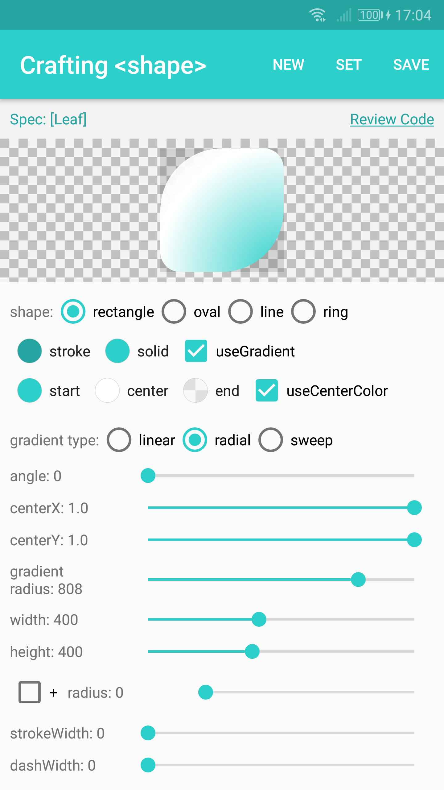
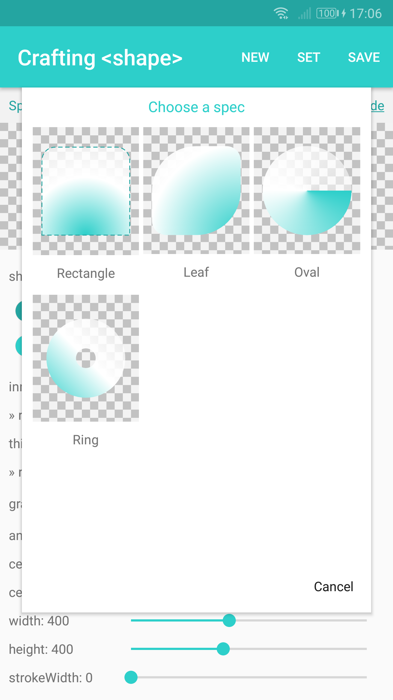
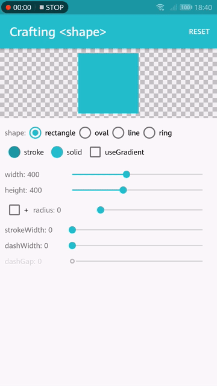

# GradientDrawableTuner 

English

Get confusing about the <shape> drawable in Android? Try playing with `GradientDrawableTuner`! With the `GradientDrawableTuner`, you can see how the properties of `GradientDrawable` affect the Drawable's appearance, intuitively.
The `GradientDrawableTuner` also support to generate the corresponding xml code.

## Features

* Almost all of the `<shape>`'s properties can be tuned.
* Generate the xml code which can build the `<shape>` you just crafted.

## Screen shots

     

## Libraries

* [DrawableToolbox](https://github.com/duanhong169/DrawableToolbox)
* [ColorPicker](https://github.com/duanhong169/ColorPicker)
* [CheckerboardDrawable](https://github.com/duanhong169/CheckerboardDrawable)
